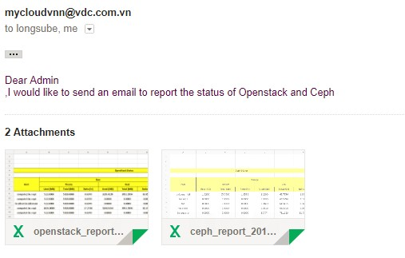
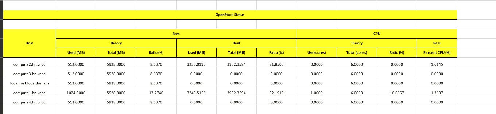
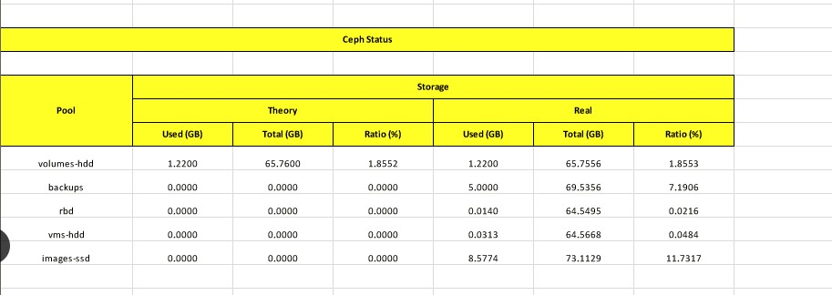

# openstack_report
Script xuất báo cáo về tình trạng sử dụng tài nguyên trên lý thuyết và thực tế:
 - CPU và RAM lý thuyết đã cung cấp trên hệ thống OpenStack: sử dụng nova api.
 - CPU và RAM thực tế đã cung cấp trên các host compute: sử dụng Zabbix api (host compute đã cài đặt Zabbix agent và giám sát tập trung tại Zabbix Server)
 - Storage dành cho volume lý thuyết: sử dụng cinder-api (chưa lấy storage cho backup và image)
 - Storage dành cho volume thực tế: sử dụng ceph-api(tham khảo hướng dẫn cấu hình ở )
 - Phiên bản OpenStack tương thích: Mitaka
 - Phiên bản Ceph tương thích: Jewel
 - Phiên bản Zabbix tương thích: 3.0

Script này chạy trên 1 máy Client (172.16.69.81), có khả năng kết nối tới các API của OpenStack, Zabbix Server, Ceph để thu thập các thông tin báo cáo.


# Hướng dẫn sử dụng
## 1. Sau khi download source code về, bắt đầu tiến hành cài đăt các package cần thiết

```sh
cd openstack_report
pip install -r /root/openstack_report/requirements.txt 
```


## 2. Thay đổi các thông số cấu hình trong /root/openstack_report//ops_report/config.py
```sh
# For OpenStack (khai báo các thông số cấu hình để kết nối tới OpenStack)
user_admin = 'admin'
pass_admin = 'xxxxxx'
keystone_ip = '172.16.69.50'
nova_ip = '172.16.69.50'
nova_port = '8774'
ratio_ram = '1.5'
ratio_cpu = '1.5'
project_name = 'admin'
project_id = 'xxxxx'
cinder_ip = '172.16.69.50'
cinder_port = '8776'
ssl = 'https'

# For Zabbix (khai báo các thông số cấu hình để kết nối tới Zabbix)
user_zabbix = 'Admin'
pass_zabbix = 'zabbix'
zabbix_ip = '172.16.69.45'
zabbix_port = '80'

# For Ceph (khai báo các thông số cấu hình để kết nối tới Ceph)
ceph_ip = '172.16.69.167'
ceph_port = '5000'

# For sending emails (khai báo mail sử dụng để gửi và nhận các báo cáo thống kê, ngăn cách bằng dấu ;)
email_from = 'abc@email.com'
pass_email_from = 'xxx'
email_to = 'xxxx@gmail.com; yyy@email.com'
email_server = 'xxxxx:port'

# Mapping Nova with Zabbix (compute1.hn.vnpt: tên compute trên OpenStack, com1_hn: tên compute trêm Zabbix)
mapping = {
    'compute1.hn.vnpt': 'com1_hn',
    'compute2.hn.vnpt': 'com2_hn',
}

# Mapping storage pool between OpenStack and Ceph (ceph_hdd: tên pool storage trên OpenStack, volumes_hdd: tên pool volume trên Ceph)
mapping_ceph = {
    'ceph_hdd': 'volumes-hdd',
}
```
## 3. Chạy script
```sh
python /root/openstack_report/run.py
```


## 4. Mail báo cáo được gửi về mail, có dạng như sau:








